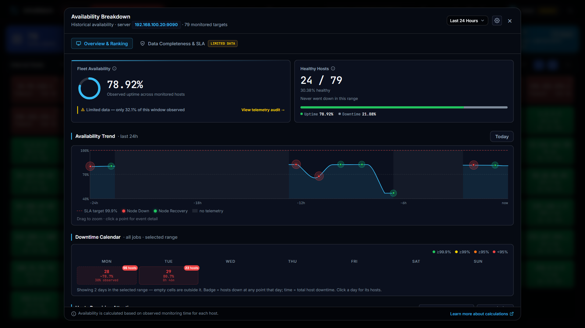
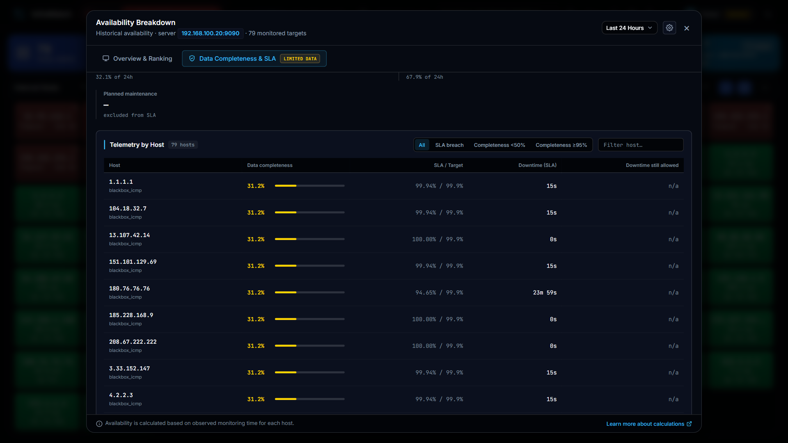
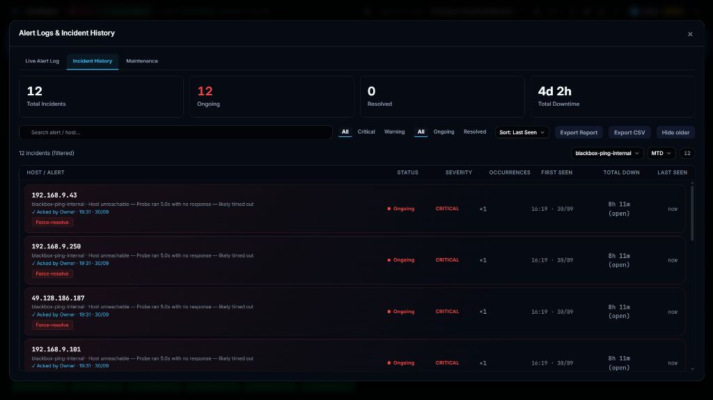
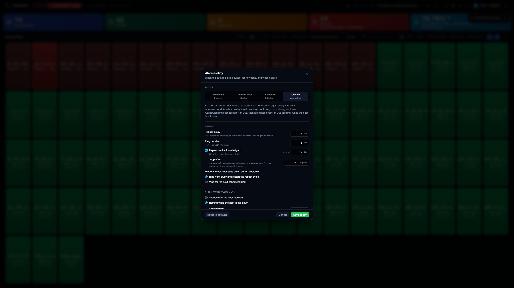
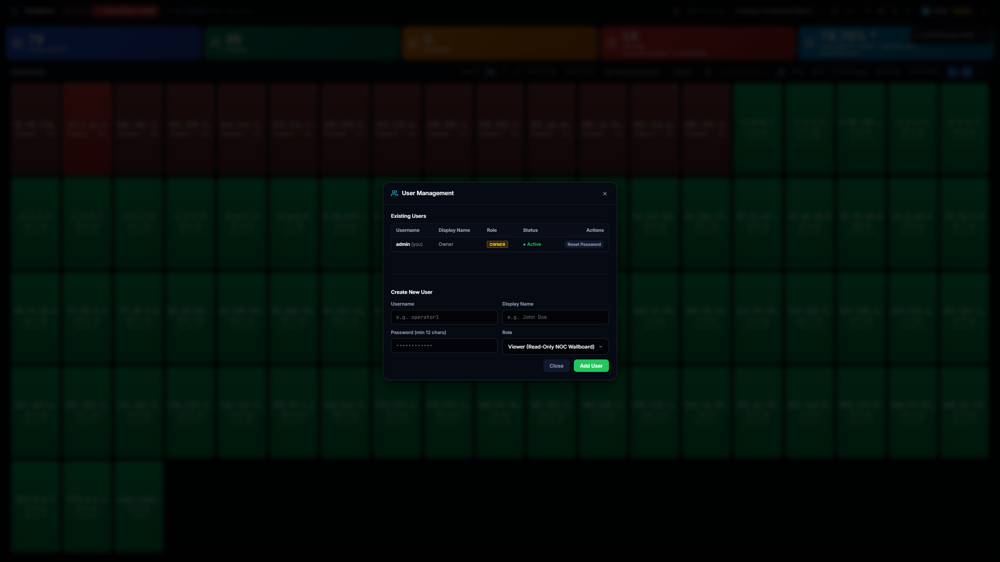
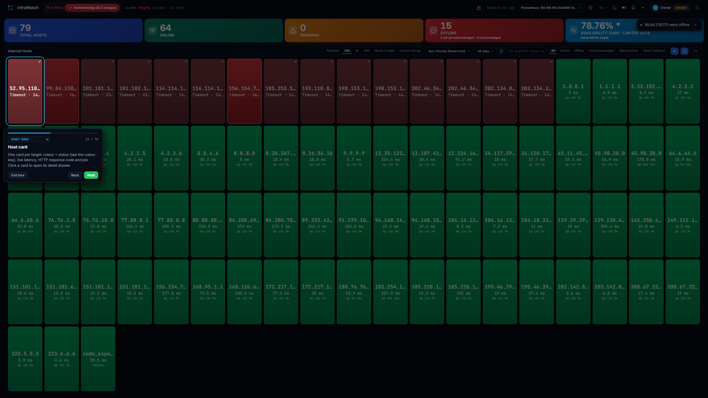
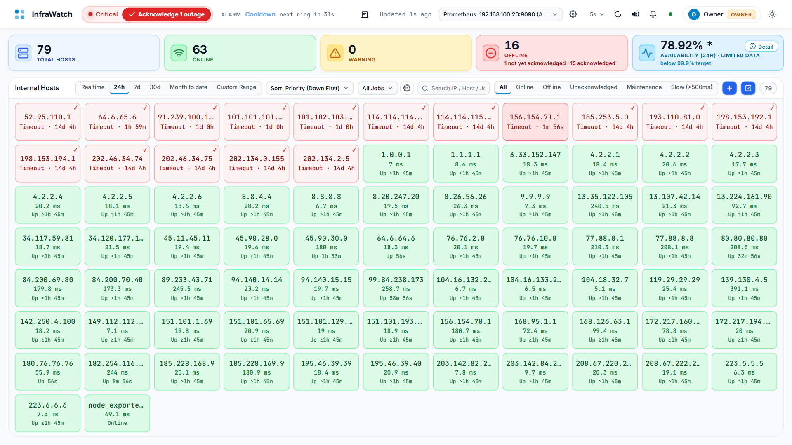

# InfraWatch — Infrastructure Monitoring & Alarm Dashboard (v3)

Dashboard NOC real-time untuk memantau ketersediaan server, website, dan jaringan berbasis **Flask** dan data probe **Prometheus (Blackbox Exporter)**. Dirancang untuk layar wallboard TV: status kontras tinggi, sirine audio yang bisa diatur, notifikasi Telegram, serta laporan SLA/availability yang bisa dipertanggungjawabkan.

> **Catatan Cakupan**: Repo ini berisi **InfraWatch** (Flask backend + web console). Prometheus dan Blackbox Exporter adalah service eksternal yang harus sudah berjalan dan dapat dijangkau oleh container InfraWatch.


---

## Daftar Isi

- [Fitur Utama](#fitur-utama)
- [Tur Tampilan](#tur-tampilan)
- [Prasyarat](#prasyarat)
- [Setup & Cara Menjalankan](#setup--cara-menjalankan)
- [Konfigurasi Environment](#konfigurasi-environment)
- [Autentikasi & Hak Akses](#autentikasi--hak-akses)
- [Daftar Endpoint REST API](#daftar-endpoint-rest-api)
- [Manajemen Target & Auto-Discovery](#manajemen-target--auto-discovery)
- [Arsitektur](#arsitektur)
- [Troubleshooting](#troubleshooting)
- [Tim & Kontributor](#tim--kontributor)

---

## Fitur Utama

### Wallboard & Operasional
- **TV Wallboard Display** — grid kartu host berwarna (Online, Slow, Down, Acknowledged, Down karena parent, Maintenance, No data) dengan latency live, HTTP code, dan durasi uptime/outage. Klik logo untuk menampilkan **legenda warna status**.
- **Pagination adaptif & Auto Rotate** — jumlah kartu per halaman menyesuaikan ukuran layar; Auto Rotate memutar halaman otomatis untuk TV.
- **Filter & pencarian** — filter status (Online, Offline, Unacknowledged, Maintenance, Slow >500 ms), filter Job dengan **Default Job** per endpoint, sort prioritas/nama/job/latency, dan pencarian IP/host/job.
- **Bulk actions** — mode Select untuk memilih banyak host sekaligus lalu menjadwalkan maintenance atau menyembunyikan target.
- **Host detail drawer** — tab Overview (status, tren response time 5m–30d/MTD/custom dengan zoom, bar availability 24 jam, info target, event terbaru, ringkasan probe), History, Events, Maintenance, dan Settings (parent host).
- **Light / Dark theme** dan dukungan tombol **Back** remote TV (Esc/GoBack/Backspace menutup panel).
- **Guided Tour** — tur interaktif 70 langkah dari menu akun yang menyorot dan menjelaskan setiap tombol & panel.

### Alarm & Notifikasi
- **Alarm Policy** — preset *Immediate*, *Transient filter*, *Standard*, atau *Custom*: trigger delay, durasi bunyi, repeat hingga di-acknowledge, batas pengulangan, perilaku saat host lain down, serta reminder setelah acknowledge.
- **Sirine kustom** — upload file audio (`.mp3/.wav/.ogg/.m4a/.webm`, maks 10 MB) atau import dari YouTube (via `yt-dlp`), lengkap dengan pemotong klip (start/end).
- **Acknowledge** — per host (drawer) atau semua outage sekaligus (top bar); status alarm armada tampil live di top bar.
- **Notifikasi Telegram** — alert FIRING / RESOLVED asynchronous, minimum severity, dan tombol test.
- **Maintenance Mode** — jendela perawatan per host atau massal (30 menit – 24 jam) untuk meredam alarm palsu; dikecualikan dari perhitungan SLA.
- **Dependency / Alert Correlation** — relasi parent-child: saat gateway/parent down, alert turunan ditandai "caused by parent" dan tidak membunyikan alarm sendiri.

### Availability & SLA
- **Deep Availability Engine** — uptime 1 jam hingga 90 hari, rekonsiliasi hybrid Prometheus TSDB + SQLite hourly buckets, single-flight request coalescing, dan cache TTL.
- **Availability Trend** — grafik tren armada dengan marker Node Down / Recovery, garis target SLA, area tanpa telemetri, zoom, dan detail event.
- **Downtime Calendar** — kalender harian berwarna per tingkat availability, badge jumlah host down, dan sorotan 3 hari terburuk.
- **Hosts Requiring Attention** — ranking host berdasarkan availability dan dampak (jumlah insiden, total downtime).
- **Data Completeness & SLA** — SLA vs target (tidak termasuk maintenance), error budget + proyeksi breach, coverage observed/unmonitored, dan telemetri per host.
- **Incident History** — riwayat insiden dengan filter severity/status/job/rentang, force-resolve, dan **Export CSV**.

### Platform
- **RBAC** — Owner (akun pendiri, diproteksi permanen), Administrator, dan Read-Only Viewer.
- **Failover Prometheus Endpoint** — beberapa endpoint Prometheus dengan auto-failover dan sinkronisasi antar klien.
- **Background workers** — Target Poller (deteksi transisi status, debounce SlowResponse) dan Availability Aggregator (bucket per jam dengan distributed lease).
- **Self-status & health probes** — indikator kesehatan InfraWatch sendiri di top bar, plus `/health`, `/health/live`, `/health/ready` untuk Docker/Kubernetes.

---

## Tur Tampilan

| | |
| --- | --- |
|  **Host detail** — status, tren latensi, availability 24 jam, info target, event, ringkasan probe. |  **Availability** — fleet availability, tren, downtime calendar, host yang perlu perhatian. |
|  **Data Completeness & SLA** — SLA vs target, error budget, coverage, telemetri per host. |  **Incident History** — insiden live & historis, filter, force-resolve, export CSV. |
|  **Alarm Policy** — preset, timing, perilaku setelah acknowledge, sirine kustom. |  **User Management** — kelola akun Admin & Viewer. |
|  **Guided Tour** — tur interaktif langkah demi langkah. |  **Light theme** — tema terang untuk ruangan terang. |

---

## Prasyarat

1. **Docker Engine + Compose plugin v2**. Di Ubuntu Server 24.04 yang masih polos:

   ```bash
   sudo apt update
   sudo apt install -y docker.io docker-compose-v2
   sudo usermod -aG docker "$USER"   # logout/login (atau: newgrp docker) agar aktif
   ```

   Verifikasi: `docker compose version` harus mencetak v2.x.
2. **Prometheus & Blackbox Exporter** yang aktif menjalankan probe target (`probe_success`, `probe_duration_seconds`, `probe_http_status_code`).

---

## Setup & Cara Menjalankan

### 1. Clone repo & siapkan environment

```bash
git clone https://github.com/malvin1205/infrawatch.git
cd infrawatch
cp .env.example .env
```

Isi minimal di `.env` (semua opsional — endpoint Prometheus dan Telegram juga bisa diatur dari UI):

```ini
PROMETHEUS_URL=http://192.168.1.10:9090
TELEGRAM_BOT_TOKEN=123456789:AAExampleToken
TELEGRAM_CHAT_ID=-1001234567890
TELEGRAM_ENABLED=true
```

### 2. Jalankan service

```bash
docker compose up -d
docker compose ps
```

Container berjalan sebagai user non-root dengan filesystem read-only; seluruh state (SQLite, key, sound kustom) disimpan di named volume `infrawatch-data` (`/app/data`).

### 3. Setup akun Owner (first-run)

1. Buka `http://<IP-SERVER>:5000`.
2. Modal **Initial System Setup** muncul otomatis pada akses pertama.
3. Isi **Nama Tampilan**, **Username** (min. 3 karakter), dan **Password** (min. 12 karakter).
4. Klik **Initialize & Log In** — akun pertama otomatis menjadi **Owner**.
5. Klik **Masuk & Aktifkan Audio Alarm** di splash screen agar browser TV mengizinkan sirine berbunyi.
6. Buka **menu akun → Guided Tour** untuk tur singkat seluruh fitur.

### Menjalankan tanpa Docker (development)

```bash
cd alarm
pip install -r requirements.txt
python app.py        # Flask dev server di http://127.0.0.1:5000
```

---

## Konfigurasi Environment

Variabel utama (lihat `.env.example`):

| Variabel | Default | Keterangan |
| --- | --- | --- |
| `PROMETHEUS_URL` | *(kosong)* | Endpoint Prometheus awal; kosong = tambahkan dari UI. Dipakai juga sebagai fallback failover. |
| `TELEGRAM_BOT_TOKEN`, `TELEGRAM_CHAT_ID` | *(kosong)* | Kredensial bot Telegram (bisa juga diatur dari UI). |
| `TELEGRAM_ENABLED` | `true` | Aktif/nonaktif notifikasi Telegram. |
| `INFRAWATCH_API_KEY` | *(auto)* | API key mesin; kosong = dibuat otomatis di `/app/data/.api_key`. |
| `WEBHOOK_SECRET` | *(auto)* | Secret header `X-Webhook-Secret` untuk `/webhook`. |
| `SESSION_COOKIE_SECURE` | `0` | Set `1` hanya jika di belakang reverse proxy HTTPS. |
| `AVAIL_TARGET_WHITELIST_FILE` | `alarm/data/target_whitelist.txt` | Daftar target yang dihitung ke SLA; `none` = hitung semua target. File kosong/hilang = tidak ada yang dihitung. |

Tuning lanjutan (tambahkan ke blok `environment:` di `docker-compose.yml` bila perlu):

| Variabel | Default | Keterangan |
| --- | --- | --- |
| `ALERT_POLL_INTERVAL` | `15` | Interval poller status target (detik). |
| `OUTAGE_GRACE_SECONDS` | `15` | Masa tenggang sebelum probe gagal dianggap outage. |
| `SLOW_RESPONSE_THRESHOLD_MS` | `500` | Ambang latensi status Slow. |
| `SLOW_RESPONSE_DEBOUNCE_N` | `3` | Jumlah probe lambat berturut-turut sebelum ditandai Slow. |
| `SLA_TARGET_PCT` | `99.9` | Target SLA default armada (bisa diubah dari UI). |
| `AVAIL_AGGREGATE_INTERVAL` | `60` | Interval aggregator bucket availability (detik). |
| `AVAIL_BUCKET_RETENTION_SECONDS` | `3024000` (35 hari) | Retensi bucket availability per jam. |
| `ALERT_TZ_OFFSET_HOURS` | `7` | Offset zona waktu tampilan (WIB). |
| `INFRAWATCH_SESSION_HOURS` | `24` | Masa berlaku sesi login. |
| `INFRAWATCH_TRUST_PROXY` | `0` | Percayai header `X-Forwarded-*` dari reverse proxy. |

---

## Autentikasi & Hak Akses

- **Owner (akun pendiri)** — hak administratif penuh; tidak dapat dinonaktifkan, role tidak dapat diubah, dan hanya owner sendiri yang dapat mengubah kredensialnya. Instalasi lama yang di-upgrade otomatis mempromosikan akun pertama menjadi `owner`.
- **Administrator** — konfigurasi operasional: target, maintenance, dependency, endpoint Prometheus, Alarm Policy & sirine, Telegram, dan manajemen user (kecuali Owner). Aturan anti-lockout mencegah admin aktif terakhir dinonaktifkan.
- **Viewer (read-only)** — hanya melihat dashboard; cocok untuk browser TV wallboard. Kontrol yang butuh hak tulis otomatis dinonaktifkan di UI.
- **Machine API Key** — untuk skrip otomasi / CI/CD:
  - Dibuat otomatis di `/app/data/.api_key` dan `/app/data/.webhook_secret`.
  - Lihat key: `docker compose exec alarm cat /app/data/.api_key`
  - Kirim sebagai `X-API-Key: <key>` atau `Authorization: Bearer <key>`.

---

## Daftar Endpoint REST API

> 🔒 = butuh sesi login dengan izin yang sesuai (Admin/Owner untuk operasi tulis) atau header `X-API-Key` / `Authorization: Bearer`.

**Monitoring & status**

| Endpoint | Method | Keterangan |
| --- | --- | --- |
| `/` | `GET` | Web console / wallboard |
| `/instances`, `/api/instances` | `GET` | Status target, latency, HTTP code, status maintenance |
| `/status`, `/api/status` | `GET` | Status global (`NORMAL`, `WARNING`, `CRITICAL`) & active alerts |
| `/logs`, `/api/logs` | `GET` | Log kejadian insiden |
| `/history`, `/api/history` | `GET` | Riwayat insiden lengkap |
| `/api/target-history` | `GET` | Timeline latensi & riwayat status satu target |
| `/api/alerts/firing` | `GET` | Insiden yang sedang firing (per endpoint aktif, atau `?source=`) |
| `/api/jobs` | `GET` | Daftar job Prometheus |
| `/api/prometheus-targets` | `GET` | Target hasil discovery Prometheus (dropdown Add Target) |

**Availability & SLA**

| Endpoint | Method | Keterangan |
| --- | --- | --- |
| `/api/availability` | `GET` | Kalkulasi availability & SLA armada |
| `/api/availability/trend` | `GET` | Data tren availability & event down/recovery |
| `/api/availability/cache/invalidate` | `POST` | Kosongkan cache availability (rate-limited) |
| `/api/sla-targets` | `GET` 🔒 / `<instance>` `PUT` 🔒 `DELETE` 🔒 | Target SLA per instance |
| `/api/slow-thresholds` | `GET` 🔒 / `<instance>` `PUT` 🔒 `DELETE` 🔒 | Ambang SlowResponse per instance |
| `/api/settings/availability` | `GET` 🔒 / `POST` 🔒 | Pengaturan availability (korelasi Node Exporter) |

**Alerts, alarm & notifikasi**

| Endpoint | Method | Keterangan |
| --- | --- | --- |
| `/api/alerts/ack` | `POST` 🔒 | Acknowledge outage aktif |
| `/api/alerts/unack` | `POST` 🔒 | Batalkan acknowledge |
| `/api/alerts/resolve` | `POST` 🔒 | Force-resolve insiden (backstop phantom incident) |
| `/api/settings/alarm-policy` | `GET` 🔒 / `POST` `PUT` 🔒 | Baca & simpan Alarm Policy |
| `/api/alarm-sounds` | `GET` 🔒 | Daftar sirine kustom |
| `/api/alarm-sounds/upload` | `POST` 🔒 | Upload file sirine (maks 10 MB) |
| `/api/alarm-sounds/import` | `POST` 🔒 | Import sirine dari URL YouTube |
| `/api/alarm-sounds/<id>` | `DELETE` 🔒 | Hapus sirine kustom |
| `/api/alarm-sounds/<id>/audio` | `GET` 🔒 | Stream file audio sirine |
| `/api/telegram` | `GET` 🔒 / `POST` `PUT` 🔒 | Konfigurasi bot Telegram |
| `/api/telegram/test` | `POST` 🔒 | Kirim pesan uji ke Telegram |
| `/webhook`, `/api/webhook` | `POST` | Receiver Alertmanager (butuh header `X-Webhook-Secret`) |

**Inventori & konfigurasi**

| Endpoint | Method | Keterangan |
| --- | --- | --- |
| `/api/targets` | `GET` / `POST` 🔒 / `DELETE` 🔒 | Sembunyikan / pulihkan target (tombstone SQLite) |
| `/api/maintenance` | `GET` / `POST` 🔒 | Daftar & buat maintenance window |
| `/api/maintenance/bulk` | `POST` 🔒 | Maintenance massal untuk banyak host |
| `/api/maintenance/<id>` | `DELETE` 🔒 | Akhiri / hapus maintenance window |
| `/api/dependencies` | `GET` / `POST` 🔒 | Daftar & buat relasi parent-child |
| `/api/dependencies/<id>` | `DELETE` 🔒 | Hapus relasi dependency |
| `/api/endpoints` | `GET` / `POST` 🔒 / `DELETE` 🔒 | Daftar endpoint Prometheus (failover) |
| `/api/endpoints/select` | `POST` 🔒 | Ganti endpoint aktif |
| `/api/audit/logs` | `GET` 🔒 | Jejak audit tindakan operator |

**Autentikasi & user**

| Endpoint | Method | Keterangan |
| --- | --- | --- |
| `/api/auth/status` | `GET` | Status inisialisasi & sesi saat ini |
| `/api/auth/setup` | `POST` | Setup akun Owner pertama kali |
| `/api/auth/login` / `/api/auth/logout` | `POST` | Login / logout (session-based) |
| `/api/auth/me` | `GET` 🔒 | Profil user yang login |
| `/api/auth/users` | `GET` 🔒 / `POST` 🔒 | Daftar & buat user |
| `/api/auth/users/<id>` | `PATCH` 🔒 | Ubah role / status / password (Owner diproteksi) |

**Health**

| Endpoint | Method | Keterangan |
| --- | --- | --- |
| `/health` | `GET` | Konektivitas Prometheus, storage, poller, aggregator |
| `/health/live` | `GET` | Liveness probe (200 jika proses web aktif) |
| `/health/ready` | `GET` | Readiness probe (200 jika database dapat ditulis) |

---

## Manajemen Target & Auto-Discovery

Semua target dideteksi otomatis dari Prometheus (`/api/v1/targets`) — cukup konfigurasikan scrape job di Prometheus / Blackbox Exporter.

- **Auto-Discovery** — poller & dashboard membaca target aktif beserta `probe_success` / `probe_duration_seconds` dari endpoint Prometheus aktif. Tidak ada file YAML lokal.
- **Sembunyikan target (tombstone reversibel)** — dari mode Select (bulk) atau `DELETE /api/targets`. Target disimpan di tabel `deleted_targets`; scraping di Prometheus tidak dihentikan.
- **Pulihkan target** — lewat tombol **+ Add Target** di dashboard (`POST /api/targets`).
- **Whitelist SLA** — hanya target di `AVAIL_TARGET_WHITELIST_FILE` yang dihitung ke SLA/Trend/Calendar.

---

## Arsitektur

- **`alarm/core/availability`** — kalkulasi availability armada, rekonsiliasi hybrid Prometheus TSDB + bucket SQLite per jam, tren & kalender downtime, error budget, single-flight coalescing dan cache TTL.
- **`alarm/core/alerts`** — engine insiden, Alarm Policy, manajemen sirine kustom, dan dispatcher Telegram.
- **`alarm/core/monitoring`** — pipeline 3 tahap: ingestion probe Prometheus → pengayaan target (maintenance, dependency, insiden, ACK) → reduksi status armada kanonikal.
- **`alarm/core/workers`** — `TargetPoller` (transisi status, debounce SlowResponse, auto-resume pasca-maintenance, rekonsiliasi alert orphaned) dan `AvailabilityAggregator` (bucket 1 jam dengan lease election).
- **`alarm/storage`** — SQLite mode WAL (`synchronous = NORMAL`, `busy_timeout = 30000`, `BEGIN IMMEDIATE`) dengan repository `alerts`, `availability`, `inventory`, `auth`, serta migrasi skema otomatis.
- **`alarm/web`** — proteksi SSRF untuk URL Prometheus, rate limiting sliding window, CSP ketat, dan middleware keamanan.
- **`alarm/static/js`** — frontend ES modules tanpa build step: `app-shell` (shell & alarm), `dashboard`, `target-drawer`, `availability`, `history`, `logs`, `alarm-policy`, `auth`, dan `tour`.

---

## Troubleshooting

- **Sirine tidak berbunyi di TV** — browser memblokir autoplay audio. Klik tombol di splash screen, pastikan ikon speaker di top bar tidak dalam posisi mute, dan cek Alarm Policy (trigger delay).
- **Import sirine dari YouTube gagal** — butuh `yt-dlp` (sudah ada di `requirements.txt`) dan akses internet dari container.
- **Prometheus tidak terjangkau** — cek `http://<IP-SERVER>:5000/health` dan indikator self-status (titik di top bar). Pastikan URL endpoint dapat dijangkau dari dalam container.
- **Login selalu terlempar keluar** — pada HTTP biasa, pastikan `SESSION_COOKIE_SECURE=0`.
- **SLA menunjukkan "Limited data"** — sebagian jendela waktu belum ada telemetri; lihat tab **Data Completeness & SLA** untuk detail coverage.
- **Log aplikasi**:
  ```bash
  docker compose logs -f alarm
  ```

---

## Tim & Kontributor

- **dimi** ([@malvin1205](https://github.com/malvin1205)) — Core
- **Fachriyusuf** ([@Fachriyusuf](https://github.com/Fachriyusuf)) — Telegram
